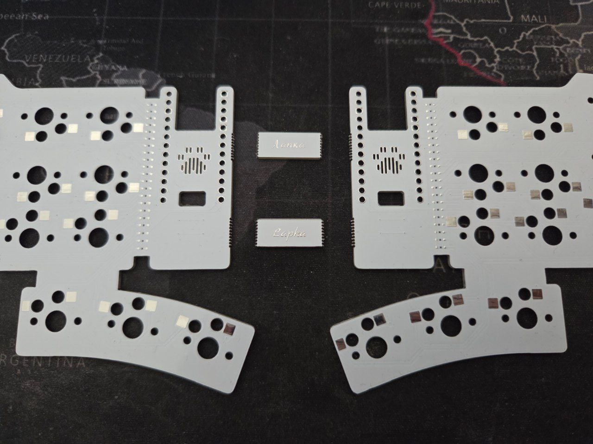
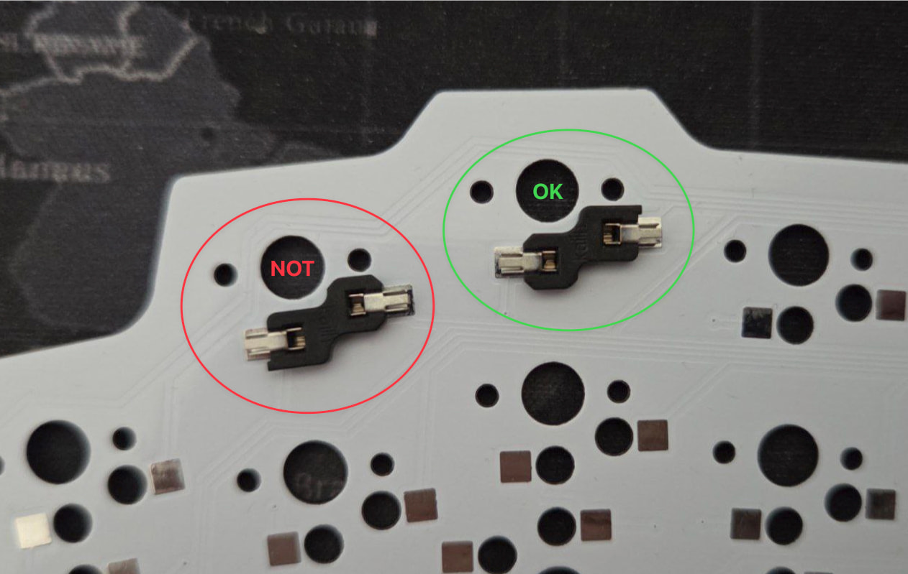
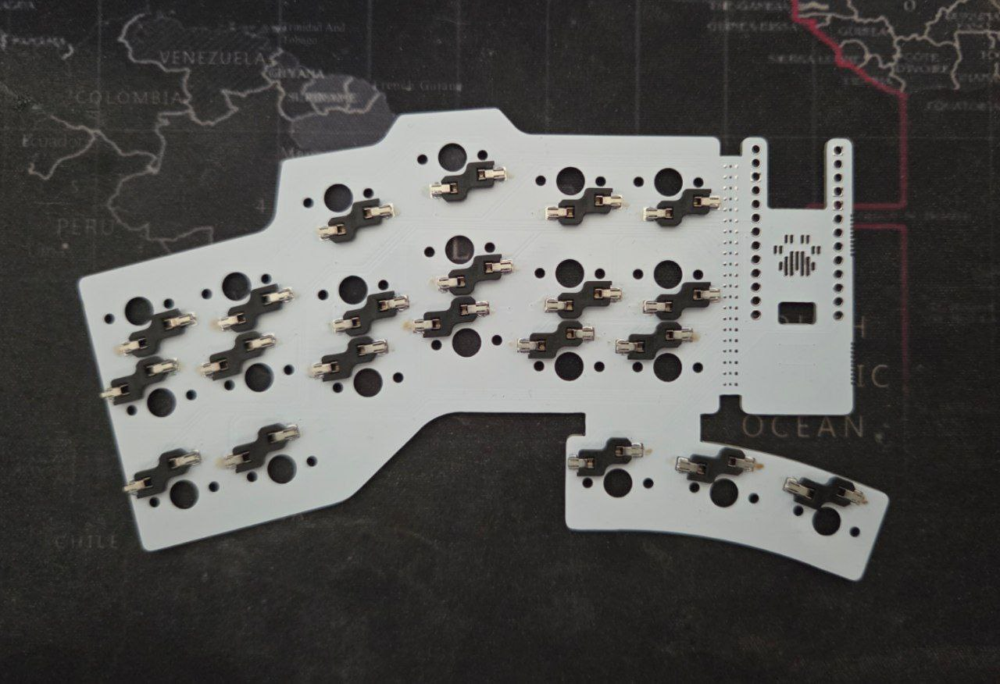
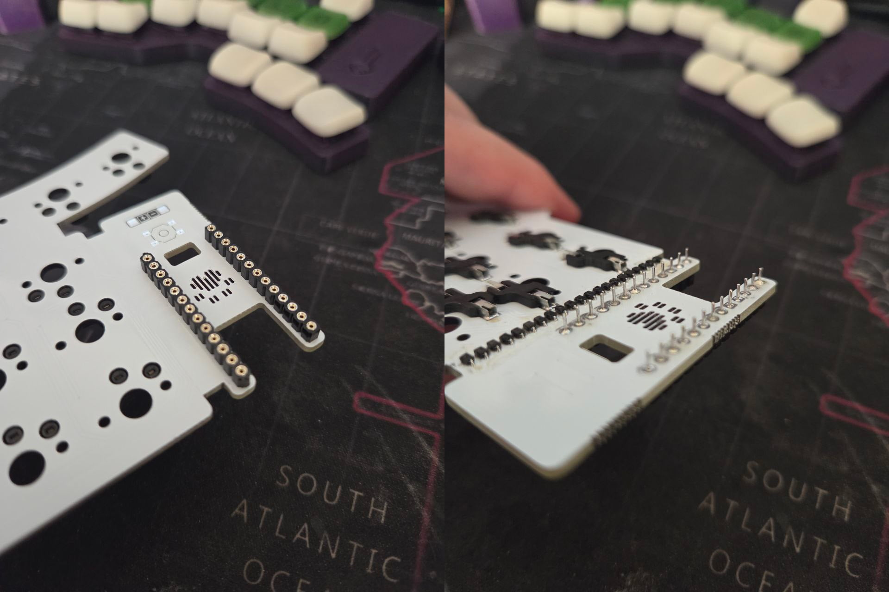
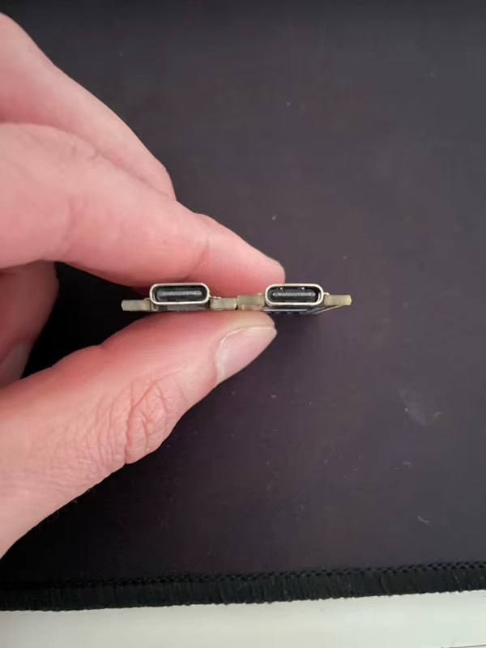

# Build guide

## List of required parts

| Part            | Amount | Description             | Link                                  |
| --------------- | ------ | ----------------------- | ------------------------------------- |
| PCB             | 2      | Main PCB board          |                                       |
| MCU             | 2      | nRF52840 MCU            | [Link](#nrf52840-mcu)                 |
| Battery         | 2      | 401230 Size, 120-150mAh | [Link](#401230-battery)               |
| Tactile button  | 2      | 4x4x1.5mm button        | [Link](#tactile-button)               |
| SMD Diode       | 42     | 1N4148 (SOD-323)        | [Link](#1n4148-sod-323-diode)         |
| Hot-Swap socket | 42     | Kailh PG1350            | [Link](#kailh-pg1350-hot-swap-socket) |
| Switches        | 42     | Kailh Choc v1 / v2      | [Link](#kailh-choc-v1--v2)            |
| Keycaps         | 42     | Choc-Spacing            | [Link](#choc-spacing-keycaps)         |
| Pin Header      | 9×2×2  | (Optional)              | [Link](#hot-swap-pin-header)          |

| Name          | Amount | Description             |
| ------------- | ------ | ----------------------- |
| `Frame_Main`  | 2      | Type-cluster case       |
| `Frame_Thumb` | 2      | Thumb-cluster case      |
| `Cover`       | 2      | Battery/Reset cover     |
| `Bottom`      | 2      | Bottom part of the case |

## Parts Links

### 401230 Battery
You can buy these in most places. These batteries are widely used in portable devices.
Don't be fooled by the large declared capacity (200-250+), often it's only 120-150mAh.

- [OZON | MyDigitals](https://www.ozon.ru/product/akkumulyator-batareya-401230-120mah-3-7v-30h12h4-mm-1812801020/)
- [AliExpress | EasyLander](https://aliexpress.ru/item/1005006119986947.html?sku_id=12000048850576528)

### nRF52840 MCU
> Notice the USB-C connector [difference](#mcu-usb-c-difference)

- [AliExpress | TENSTAR Store](https://aliexpress.ru/item/1005006282506884.html)
- [AliExpress | Simple Robot Store](https://aliexpress.ru/item/1005008896713501.html)

### Hot-Swap Pin Header
This is completely optional. You can solder MCU to PCB with those that come with MCU.
However, using Hot-Swap Pin Headers is more convinient even if you won't use hot-swap.

- [AliExpress | EQV Official Store](https://aliexpress.ru/item/1005007465756012.html)

### 1N4148 SOD-323 Diode
- [AliExpress | TZT teng Official Store](https://aliexpress.ru/item/1005008443360532.html)

### Tactile Button
- [AliExpress | LOSUYINE Store](https://aliexpress.ru/item/32815925814.html)
- [AliExpress | KRYOND Electronic Store](https://aliexpress.ru/item/1005009981759314.html)

### Kailh PG1350 Hot-Swap Socket
- [AliExpress | Dafu Store](https://aliexpress.ru/item/1005009449387695.html)
- [AliExpress | KBDiy Switch Store](https://aliexpress.ru/item/1005004916925259.html)

### Kailh Choc v1 / v2
I highly recommend checking out [Watchman's Switch Database](https://aroum.github.io)

### Choc-Spacing Keycaps
> Currently, there are almost no keycaps for Choc v2 with Choc spacing on the market. Of the open-source options, I can only suggest [KLP Lamé](https://github.com/braindefender/KLP-Lame-Keycaps).

- [GitHub | KLP Lamé](https://github.com/braindefender/KLP-Lame-Keycaps)
- [GitHub | GammaCaps](https://github.com/sqdbruh/gammacaps)
- [BeeKeeb | Tai-Hao THCS](https://showcase.beekeeb.com/choc-spaced-chocv2-keycaps/)

## Guide

1. Make sure you have all the necessary parts for assembly, as well as a soldering iron, solder paste, or solder wire (soldering paste will be much easier).

2. Separate the boards from the shipping connectors. This can be done by gently breaking them off, holding them with your fingers near the break seam.

3. Apply solder paste to the hotswap socket pads and solder the sockets. The socket should be positioned so that the larger part faces out to the side and the smaller part faces the center.

> I usually apply solder paste to all the socket pads, then install the sockets and solder one right pin of each socket (from right to left) first, holding the socket with my finger. After that, I rotate the board 180° and repeat the same process for the left pin of the socket. This allows me to solder all the sockets quickly and without misalignment.

4. Apply solder paste to the pads for the SMD diodes and solder the diodes themselves. The diodes should be positioned according to the [markings](#1n4148w-t4-diode-markings). Two stripes on the diode body indicate the position of the **cathode** — so we position the diodes so that these two stripes face the controller.

5. Prepare the pin headers. To measure how much to break it, push the pins into the holes on either side of the board. You should have exactly 9 pins. We'll need two of these pieces.

6. Apply solder paste to the pin header holes and install the pin header in the holes so that the plastic part is on the opposite side from the diodes/sockets. You can solder the outer pins to keep it in place. During soldering, any solder paste remaining on the pins will naturally move down to the pad.

7. After the hotswap sockets, diodes, and pin headers have been soldered, thoroughly clean the board of flux. I do this with isopropyl alcohol, wiping the pads with a toothbrush or a stiff brush. After cleaning, leave the board in a warm place to allow all the alcohol or water to dry. While one board is drying, you can begin soldering the other half.

8. Make sure the nRF52840 controllers are working properly. To do this, you can flash a [test firmware](https://github.com/braindefender/lapka-zmk-config/tree/lapka-42-test), short the row and column contacts in pairs, and observe how the keys are pressed using [key-test](https://key-test.ru). Or, you can skip this step at your own risk. However, desoldering a faulty controller is the last thing you want to do, so it's better to be safe than sorry.

9. Install the nRF52840 controller on the pins with the SMD components facing the board. There are cutouts on the board for the antenna, USB Type-C connector, and a couple of (transistors?). After installing the controller, apply solder paste to the contacts and solder it. Be careful to hold the controller level when soldering, otherwise one side will stick out beyond the case.

10. Apply solder paste to the tactile button and battery pads and solder them in place. The black wire is the minus, and the red wire is plus. The tactile button also has polarity — position it horizontally.

11. Once all the components are soldered, you can install the case parts and insert the switches into the sockets. Done! Now you can [flash the keyboard](../README_EN.md#firmware) and use it.

## Notes

### MCU USB-C Difference

[nRF52840](https://github.com/joric/nrfmicro/wiki/Alternatives#supermini-nrf52840) is sold in several variants, among which there is a difference in the USB Type-C connector. For example, boards from Simple Robot Store have an extended USB-C port, while most boards from other vendors/manufacturers have a standard USB-C port. The MCU enclosure supports both types.

### 1N4148W (T4) Diode markings

Cathode is marked with one or several stripes on the diode body.

