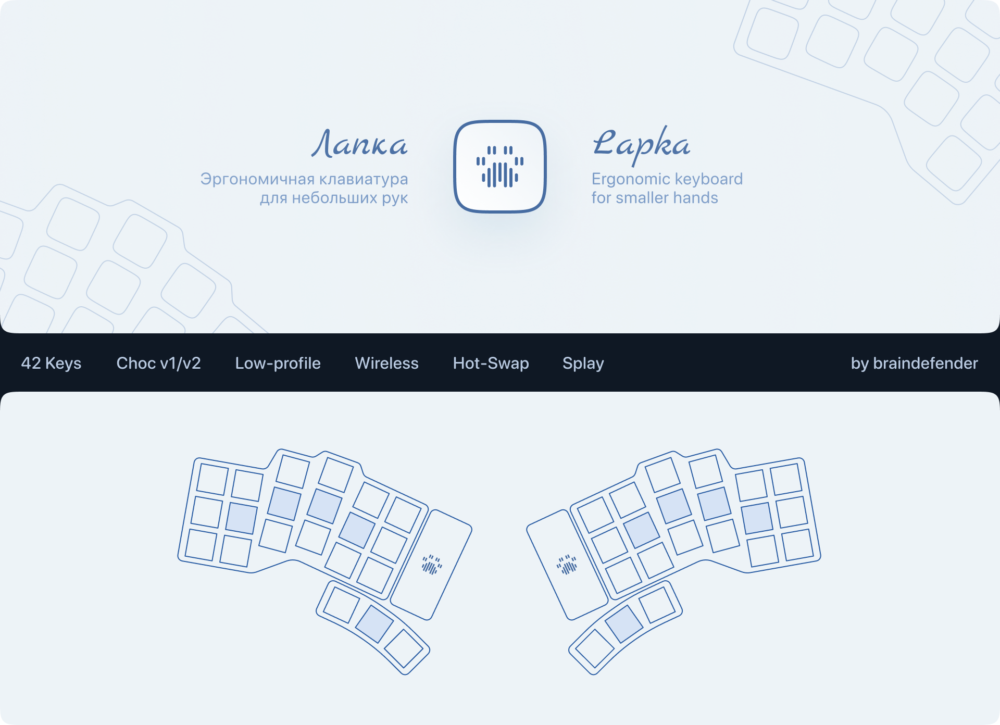
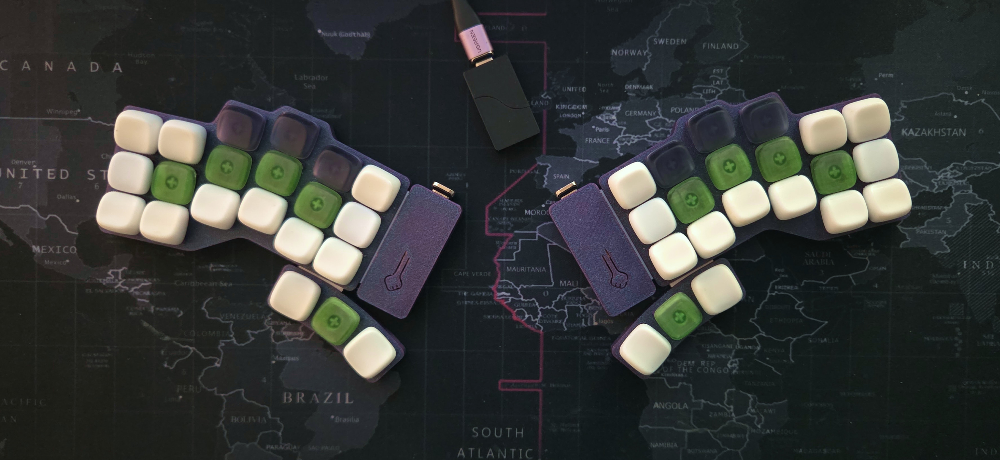
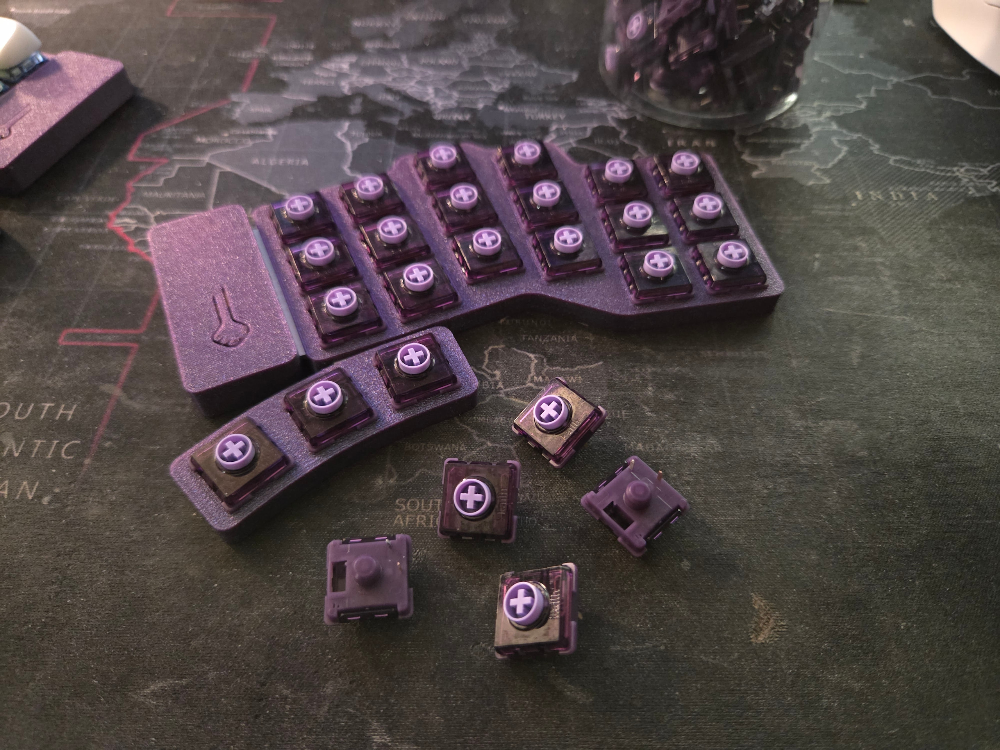

[Русская версия этого README](./README.md)

# Lapka 42

Wireless ergonomic split keyboard for those who have paws (:

**Information:**

|                           |                                 |
| :------------------------ | :------------------------------ |
| **Keys**                  | 42                              |
| **Matrix type**           | Diode                           |
| **Diode direction**       | Col2Row                         |
| **MCU compatibility**     | nRF52840 (SuperMini, nice!nano) |
| **Battery compatibility** | 401230                          |
| **Switch compatibility**  | Choc v1/v2                      |
| **Switch spacing**        | Choc (18×17mm)                  |
| **Key alignment**         | Splay                           |

**Repo structure:**

| Directory | Description                                        |
| --------: | :------------------------------------------------- |
|       3MF | OrcaSlicer project files                           |
|    Assets | Images and photos                                  |
|     Build | Detailed [build guide](./Build/BUILD_GUIDE_EN.md)  |
|    Fusion | Autodesk Fusion 360 project                        |
|   Gerbers | Gerber-files for PCB production                    |
|     KiCad | KiCad project (schematics, PCB design, components) |
|       STL | 3D-models of case parts                            |

**Case parts:**
|   File | Description                                                         |
| -----: | :------------------------------------------------------------------ |
| Bottom | Bottom part of the case, has cutouts for hotswap-sockets and diodes |
|  Cover | Cover part for the battery and reset button                         |
|  Frame | Top part of the case, for typing-cluster                            |
|  Thumb | Top part of the case, for thumb-cluster                             |

**Pin layout:**

> C — columns, R — rows, indexing from left to right, top to bottom

|  Pin  | Left  | Right |
| :---: | :---: | :---: |
|  C0   |  D4   |  D10  |
|  C1   |  D5   |  D16  |
|  C2   |  D6   |  D14  |
|  C3   |  D7   |  D15  |
|  C4   |  D8   |  D18  |
|  C5   |  D9   |  D19  |
|       |       |
|  R0   |  D2   |  D21  |
|  R1   |  D3   |  D20  |
|  R2   |  D16  |  D8   |
|  R3   |  D10  |  D9   |

## Changelog

### v1
- Initial release.

## Photos

